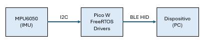

# Projeto AirMouse – Documentação Inicial

## 1. Ideia Geral

O **AirMouse** tem como objetivo transformar um *Raspberry Pi Pico W* em um mouse do tipo "pointer" controlado por movimento (air mouse), utilizando uma **MPU6050**, 4 **jumpers macho-macho** e uma **protoboard**. O movimento do cursor é controlado com base nas acelerações e rotações detectadas pela IMU, e a comunicação com o computador é feita por **Bluetooth LE** via perfil **HID**.

Funcionalidades principais:

- **Controle de cursor por movimento** (ΔX/ΔY via acelerômetro)
- **Conectividade Bluetooth Low Energy (BLE)** com perfil HID
- **Organização modular do código**, com bibliotecas separadas para o Bluetooth e o sensor MPU6050

---

## 2. Diagrama de Alto Nível

---

## 3. Componentes Utilizados

| #  | Componente             | Especificações                        | Qtde | Preço Estimado |
|----|------------------------|----------------------------------------|------|----------------|
| 1  | Raspberry Pi Pico W    | RP2040 com módulo Wi-Fi + BLE (CYW43)  | 1    | R$ 45–60       |
| 2  | MPU6050                | IMU com acelerômetro e giroscópio      | 1    | R$ 10–20       |
| 3  | Jumpers macho-macho    | 10–20 cm                               | 4    | R$ 1–2         |
| 4  | Protoboard             | 400 pontos ou maior                   | 1    | R$ 10–15       |

---

## 4. Integração das Especialidades

| Especialidade         | Entregáveis e Integração                                                                 |
|----------------------|------------------------------------------------------------------------------------------|
| **Firmware (Lab 1)** | Biblioteca modular para MPU6050 (`mpu6050/`) com funções de leitura e inicialização I²C |
|                      | Task FreeRTOS para leitura periódica e comunicação com a task de Bluetooth               |
| **Comunicação (Lab 2)** | Implementação da pilha Bluetooth usando **BTstack**                                   |
|                      | Biblioteca separada em `bluetooth/` com inicialização BLE HID e envio de relatórios     |

---

## 5. Organização do Projeto

📁 projeto/
├── main/ # Task principal e lógica do programa
├── mpu6050/ # Driver da IMU (aceleração, giroscópio)
├── CMakeLists.txt # Build do projeto
└── README.md # Documentação (este arquivo)